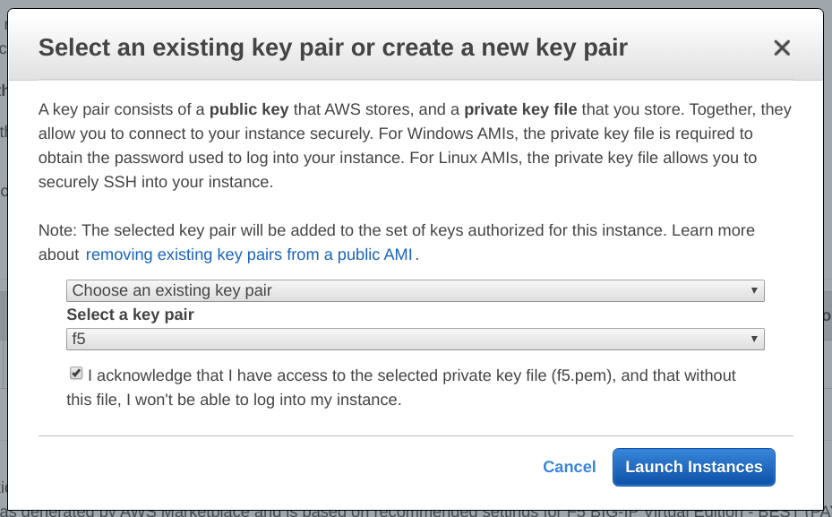
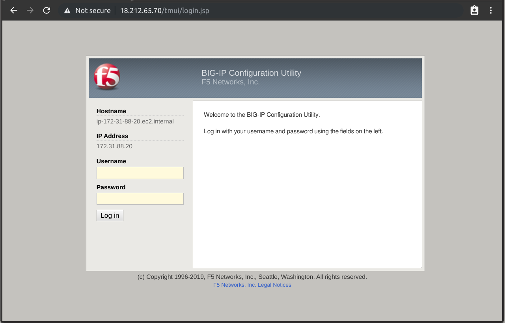
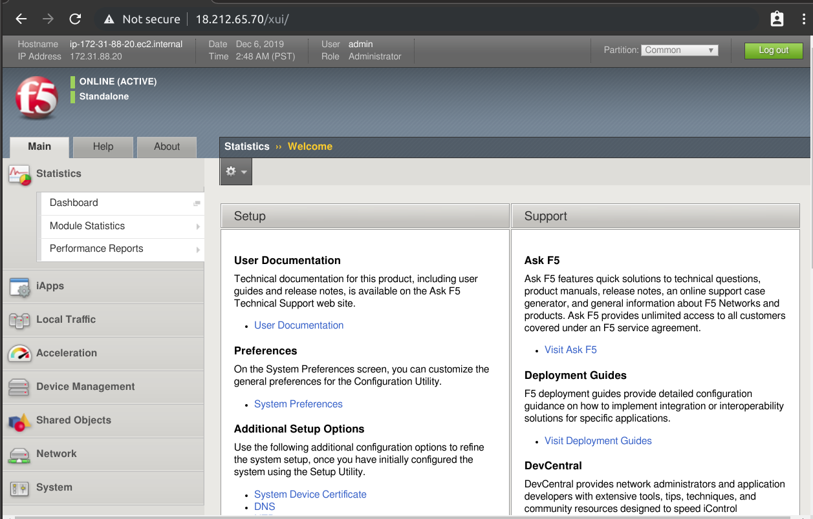
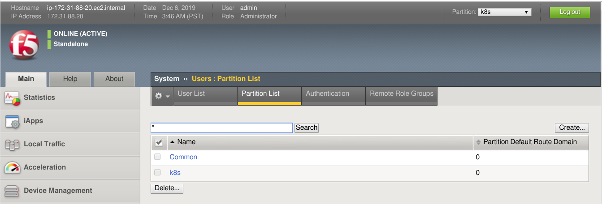
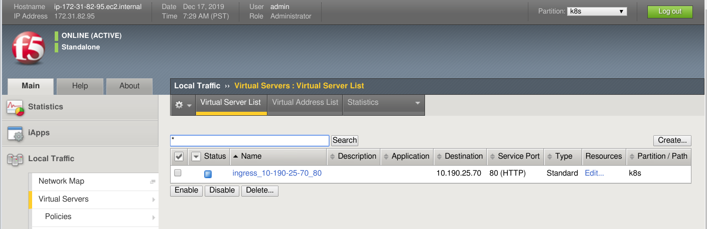
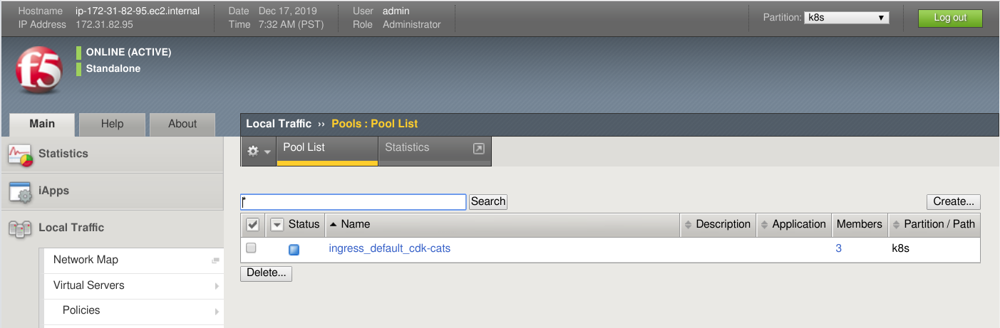

# Deploying F5 Big-IP Load Balancers on Charmed Kubernetes

## Overview
Duration: 3:00

Most container orchestration environments come “out of the box” with proxies capable of vanilla scale. But what if you have an environment where services are not differentiated based on an IP address/port combination, but by HTTP layer characteristics – like API version, or URI, or host name? 

That’s where ingress controllers enter the picture. These are the “load balancers” that dissect and direct ingress traffic based on URIs and HTTP headers to enable application layer routing and scalability. That’s what the BIG-IP Controller for Kubernetes does. It’s a Docker container that runs in a Kubernetes Pod and enables you to use a BIG-IP as a Kubernetes Ingress controller. That means it can read the Kubernetes Ingress resource and automatically configure BIG-IP with the appropriate objects to make sure requests are scaled based on the app layer constructs you desire.

### What you'll learn
 - Deploy F5 Big-IP Load Balancer on AWS
 - Configure your F5 Big-IP Load-Balancer
 - Deploy the F5 Big-IP Load-Balancer Controller on Charmed Kubernetes
 - Utilise you F5 Big-IP Load Balancer with Kubernetes

### What you'll need
 * Account credentials for [AWS][aws-console]
 * A healthy Charmed Kubernetes cluster running on AWS

positive
: If you do not have a Charmed Kubernetes cluster, you can refer to the following [tutorial][charmed-kubernetes] to spin up one in minutes. Charmed Kubernetes is a production-grade Kubernetes offering from Canonical which is fully compliant with the upstream project.

Survey
: How will you use this tutorial?
 - Only read through it
 - Read it and complete the exercises
: What is your current level of experience?
 - Novice
 - Intermediate
 - Proficient
 
## Prepare your cluster
Duration: 2:00

Make sure that your Kubernetes cluster is running and kubectl config is in `~/.kube/config`.

```bash
juju scp kubernetes-master/0:config ~/.kube/config
```

## Deploy Load Balancer
Duration: 10:00

As we've just deployed Kubernetes on AWS, we will spin-up the load-balancer on that platform as well.  F5 Network's BigIP Product is shipped either as a physical or virtual device. They also provide an AWS AMI on the AWS Market Place which is useful for testing.

The AMI I chose is called '[F5 BIG-IP Virtual Edition - GOOD - (Hourly, 200Mbps, v13)][f5-AMI]'. Note that F5's licensing model revolves around flavours, ‘GOOD’ being the cheapest licence, and ‘BEST’ being the most feature-rich offering. You can find more about licencing on [F5 Cloud Licensing Program][f5-licensing].

Depending on which type of licence you have, your load-balancer options may be limited. For example, if you want to directly integrate the F5 Big-IP devices into your Kubernetes network, you will need to have a 'BEST' type licence. 

### Launch an instance on AWS
Login to [AWS console][aws-console]. Select the correct region for where you deployed your cluster with Juju, in my case it was us-east-1. To check which region is your controller on:

```bash
juju show-controller k8s | grep region
```

Go to EC2, make sure you have a private key setup, if not select ‘Create Key Pair’. And put the downloaded file in your .ssh directory. 

Then hit ‘Launch instance’, go to AWS Marketplace, type F5 BIG-IP and pick an image. 


Choose a flavor and hit ‘Review and Launch’. We will use the default configurations for now. Hit ‘Launch’ again and make sure you pick the right SSH keypair:


### Change admin password
SSH to the load balancer using the SSH key you setup, you can find the public IP address for the machine by looking at the machine in the EC2 GUI:

```bash
ssh -i ~/.ssh/f5.pem admin@18.212.65.70
```

Next we change the password:

```bash
modify auth user admin password <yourpassword>
```

### Change UI port
The default UI will run on port 8443 if only give the F5 device one interface, however, the container expects 443 so we must change it:

```bash
modify sys httpd ssl-port 443
```

Save the configurations:

```bash
save sys config
```

Type quit after you're done.

### Log in to web-interface
You can test connectivity to the web gui using your web browser or wget:

```bash
wget https://<your F5 public ip or vip>:443/ --no-check-certificate
```


Enter your credentials, login and you should see this screen:


## Configure Load-Balancer
Duration: 3:00

Before we configure the F5 Big-IP Load-balancer controller container, we must configure some additional things on the load-balancer.

Note in the top-right handside of the F5 Load-Balancer interface it says Partition: 'common'. Partitions are used to essentially carve-up an F5 device for multiple users or projects. Each partition has its own set of associated F5 objects. The container we deploy on-top of Kubernetes to control the Big-IP device is unable to manage objects within the common partition and a new one must be created called k8s.

From the default GUI page, go to System -> Users -> Partition List:


On the partition list, you should see 'Common', hit the Create button on the right hand side. Fill in the details for the new partition and call it 'k8s':


Finally hit the 'Finish' button and we're ready to go. You should see two partitions now in the partition list. Depending on where you browse around, you can set the Partition in the top-right to 'k8s', which will filter your view to objects which belong to the k8s partition.


## Create Controller Container
Duration: 10:00

Most third-party product integrations for Kubernetes are pretty transparent to the cluster itself. They usually function like so:
 - Company produces a container for their product which is able to interact with the API(s) provided by their product.
 - You deploy the third-party product (in our case, F5 Big-IP Load Balancer) and configure some credentials for the API.
 - You deploy the third-party container on your kubernetes cluster for the specific device with the API endpoint and credentials specified.
 - The container picks up constructs which are created on Kubernetes and replicates them onto the Load-balancer, such as ingress rule creation.

The F5 Big-IP Controller container functions like this as well. It is an open-source workload which interacts with the Kubernetes API and the API of the Big-IP load balancer to automatically configure the load-balancer based on objects created on kubernetes:


### Creating the container
The yaml file `cdk-f5-big-ip.yaml` included in this tutorial describes the deployment of the F5 Big-IP Controller Container on-top of CDK. The example file has been created based on [documentation][f5-controller] on F5's website.

Let's breakdown and examine the yaml:

```yaml
---
apiVersion: v1
kind: Secret
metadata:
  name: bigip-credentials
type: Opaque
data:
  url: <BASE64-F5-URL>
  username: <BASE64-USERNAME>
  password: <BASE64-PASSWORD>
---
  apiVersion: v1
  kind: ServiceAccount
  metadata:
    name: bigip-ctlr-serviceaccount
    namespace: default
---
apiVersion: apps/v1
kind: Deployment
metadata:
  name: k8s-bigip-ctlr
  namespace: default
spec:
  selector:
    matchLabels:
      app: k8s-bigip-ctlr
  replicas: 1
  template:
    metadata:
      name: k8s-bigip-ctlr
      labels:
        app: k8s-bigip-ctlr
    spec:
      serviceAccountName: bigip-ctlr-serviceaccount
      containers:
        - name: k8s-bigip-ctlr
          image: "f5networks/k8s-bigip-ctlr"
          env:
            - name: BIGIP_USERNAME
              valueFrom:
               secretKeyRef:
                name: bigip-credentials
                key: username
            - name: BIGIP_PASSWORD
              valueFrom:
               secretKeyRef:
                name: bigip-credentials
                key: password
            - name: BIGIP_URL
              valueFrom:
               secretKeyRef:
                name: bigip-credentials
                key: url
          command: ["/app/bin/k8s-bigip-ctlr"]
          args: ["--running-in-cluster=true",
            "--bigip-url=$(BIGIP_URL)",
            "--bigip-username=$(BIGIP_USERNAME)",
            "--bigip-password=$(BIGIP_PASSWORD)",
            "--bigip-partition=k8s",
            "--namespace=default",
            "--python-basedir=/app/python",
            "--log-level=INFO",
            "--verify-interval=30",
            "--use-node-internal=true",
            "--pool-member-type=nodeport",
            "--kubeconfig=./config"
          ]
```

The first section of this yaml file creates a secret, which is used to store the API end-point and credentials the load-balancer controller container will use to access the API of the Load-balancer device itself. These credentials are simple base64 encoded strings. Let's replace these values.

First generate some new base64 encoded strings:

```bash
echo -n "admin" | base64
echo -n "https://100.26.104.89" | base64
```

You can also decode strings on the command line:

```bash
echo -n "aHR0cHM6Ly8xMDAuMjYuMTA0Ljg5" | base64 --decode
```

Next we modify cdk-f5-big-ip.yaml and replace the existing username, password and URL values:

```bash
sed -i 's/<BASE64-F5-URL>/<YOUR-BASE64-F5-URL>/g' cdk-f5-big-ip.yaml
sed -i 's/<BASE64-USERNAME>/<YOUR-BASE64-USERNAME>/g' cdk-f5-big-ip.yaml
sed -i 's/<BASE64-PASSWORD>/<YOUR-BASE64-PASSWORD>/g' cdk-f5-big-ip.yaml
```

Once you've changed the file, the section secret section should now look like this, your base64 values should be different:

```yaml
---
apiVersion: v1
kind: Secret
metadata:
  name: bigip-credentials
type: Opaque
data:
  url: aHR0cHM6Ly8xMDAuMjYuMTA0Ljg5Ojg0NDM=
  username: YWRtaW4=
  password: YWRtaW4=
```

## Deploy Load-Balancer Controller Container
Duration: 5:00

Now we're ready to deploy our new container:

```bash
kubectl apply -f cdk-f5-big-ip.yaml
```

Next, we check the pod status and watch for the controller to be deployed:

```bash
kubectl get pods
```

The output should look like following:

```bash
NAME                              READY   STATUS    RESTARTS   AGE
k8s-bigip-ctlr-669d7fcfcc-lmrb4   1/1     Running   0          4m7s
```

Now we're ready to utilise the load-balancer through Kubernetes. Note that at the bottom section of `cdk-f5-big-ip.yaml` there is a section of run time arguments for the F5 Big-IP controller:

```yaml
args: ["--running-in-cluster=true",
  "--bigip-url=$(BIGIP_URL)",
  "--bigip-username=$(BIGIP_USERNAME)",
  "--bigip-password=$(BIGIP_PASSWORD)",
  "--bigip-partition=k8s",
  "--namespace=default",
  "--python-basedir=/app/python",
  "--log-level=INFO",
  "--verify-interval=30",
  "--use-node-internal=true",
  "--pool-member-type=nodeport",
  "--kubeconfig=./config"
]
```

These options are incredibly important for controlling the integration of the two products. It is highly recommended that you read the [F5 provided manual][f5-controller] to understand these options in more detail. 

positive
: As the `--pool-member-type` is set to nodeport, we need to set type `nodeport` to each of the services we create on Kubernetes in order for these to be picked up. More information on this can be found in [F5 BIG-IP Controller Modes][f5-controller-modes] documentation.

## Utilise Load Balancer with Kubernetes
Duration: 10:00

Next we will set up an example workload which will create objects on the load-balancer. Create a file called `cdk-f5-ingress-example.yaml`:

```yaml
---
apiVersion: apps/v1
kind: Deployment
metadata:
  creationTimestamp: null
  labels:
    app: cdk-cats
  name:  cdk-cats
spec:
  replicas: 1
  selector:
    matchLabels:
      app:  cdk-cats
  strategy: {}
  template:
    metadata:
      creationTimestamp: null
      labels:
        app:  cdk-cats
        ima: pod
    spec:
      containers:
      - image: calvinhartwell/cdk-cats:latest
        imagePullPolicy: Always
        name: cdk-cats
        ports:
        - containerPort: 80
        livenessProbe:
          httpGet:
            path: /
            port: 80
          initialDelaySeconds: 5
          timeoutSeconds: 30
        resources: {}
      restartPolicy: Always
      serviceAccountName: ""
status: {}
---
apiVersion: v1
kind: Service
metadata:
  name: cdk-cats
  labels:
    app: cdk-cats
spec:
  type: NodePort
  ports:
    - port: 80
      targetPort: 80
      protocol: TCP
  selector:
    app: cdk-cats
---
apiVersion: extensions/v1beta1
kind: Ingress
metadata:
  name: cdk-cats
  namespace: default
  annotations:
    # Provide an IP address from the external VLAN on your BIG-IP device
    virtual-server.f5.com/ip: "10.190.25.70"
    # Specify the BIG-IP partition containing the virtual server
    virtual-server.f5.com/partition: "k8s"
spec:
  backend:
    # The name of the Kubernetes Service you want to expose to external traffic
    serviceName: cdk-cats
    servicePort: 80
```

Essentially this yaml describes the deployment of a single container, service and ingress rule. The ingress rule has annotations added to it which are picked up by the F5 Big-IP Controller container and replicated to the load-balancer automatically. Note, because we are using nodeport, the service has been given the type 'NodePort'. The most important part of this example is the ingress rule at the bottom.

The annotations section is used to inform the Big-IP controller to pick-up information regarding the ingress rule, such as the IP address, port, partition name, etc. A full list of annotations and further examples can be found in the [F5 controller manual][f5-controller].

To deploy the workload, all we need to do is run the following command:

```bash
kubectl apply -f cdk-f5-ingress-example.yaml 
```

This will cause Kubernetes to pull and run the container by creating a deployment:

```bash
kubectl get pods
```

The output should look like following:

```bash
NAME                              READY   STATUS    RESTARTS   AGE
cdk-cats-9c58684c9-4fg59          1/1     Running   0          5m24s
k8s-bigip-ctlr-669d7fcfcc-wwb4k   1/1     Running   0          6m20s
```

It will also create the service and the ingress rule. You can tail the logs of your Big-IP Controller container logs:

```bash
kubectl logs  -f k8s-bigip-ctlr-669d7fcfcc-wwb4k
```
You should see messages like this:

```bash
2019/12/17 15:13:32 [INFO] Starting: Version: 1.12.0, BuildInfo: n2050-623590021
2019/12/17 15:13:32 [INFO] ConfigWriter started: 0xc000288d80
2019/12/17 15:13:32 [INFO] Started config driver sub-process at pid: 12
2019/12/17 15:13:32 [INFO] NodePoller (0xc0001226c0) registering new listener: 0x11bfea0
2019/12/17 15:13:32 [INFO] NodePoller started: (0xc0001226c0)
2019/12/17 15:13:32 [INFO] Watching Ingress resources.
2019/12/17 15:13:32 [INFO] Watching ConfigMap resources.
2019/12/17 15:13:32 [INFO] Handling ConfigMap resource events.
2019/12/17 15:13:32 [INFO] Handling Ingress resource events.
2019/12/17 15:13:32 [INFO] Registered BigIP Metrics
2019/12/17 15:13:33 [WARNING] Overwriting existing entry for backend {ServiceName:cdk-cats ServicePort:80 Namespace:default}
2019/12/17 15:13:33 [INFO] Wrote 1 Virtual Server and 0 IApp configs
2019/12/17 15:13:34 [INFO] [2019-12-17 15:13:34,214 __main__ INFO] entering inotify loop to watch /tmp/k8s-bigip-ctlr.config870278581/config.json
2019/12/17 15:13:34 [INFO] [2019-12-17 15:13:34,654 f5_cccl.resource.resource INFO] Creating ApiPool: /k8s/ingress_default_cdk-cats
2019/12/17 15:13:34 [INFO] [2019-12-17 15:13:34,980 f5_cccl.resource.resource INFO] Creating ApiVirtualServer: /k8s/ingress_10-190-25-70_80
2019/12/17 15:14:02 [INFO] Wrote 1 Virtual Server and 0 IApp configs
```

This indicates that the Big-IP controller container has picked up the ingress rule and replicated onto the load-balancer. 

We can check that by logging onto the F5 Load-Balancer interface and going to the virtual server list. Make sure your partition is set to k8s in the top-right hand corner, otherwise you may not be able to see the objects:


As you can see, the name (ingress_10-190-25-70_80) for the newly created Virtual Server has been generated based on the IP address specified as the `virtual-server.f5.com/ip` annotation and the servicePort which has been set to 80. If you click into the virtual server you can check that the rule matches your specification.

The controller container has also created a pool list for us automatically. Using the GUI on the left-hand side, click the Pools tab and go to Pool List. You should see a newly created pool based on the name of your ingress rule:


## Removing things
Duration: 3

### Removing the F5 Big-IP Controller Container
If you wish to remove the F5 Big-IP Controller from the cluster, we can do it using kubectl. Deleting constructs in Kubernetes is as simple as creating them:

```bash
kubectl delete -f cdk-f5-ingress-example.yaml 
```

### Removing the F5 Big-IP Load-Balancer
Removing the load-balancer is just as easy as deploying it, just destroy the VM in the AWS EC2 web interface or using the cli-tool. Remember to clean-up any volumes you attached to the VM, any security groups you created and any SSH key-pairs you no longer need. If you've run the rest of the steps, make sure you remove the F5 Big-IP load balancer container from your cluster as well.

## That's all folks!
Duration: 1:00

Congratulations! In this tutorial, you deployed F5 Big-IP Load-Balancer and integrated it with Charmed Kubernetes on AWS. You also deployed a simple workload to see how this integration works.

### Where to go from here?
- Explore [Charmed Kubernetes][charmed-kubernetes]
- Use Kubernetes straight away for free with [MicroK8s][microk8s]
- Looking for production-grade [Kubernetes?][prod-kubernetes]
- Find out more about F5 Big-IP in [documentation][f5-kubernetes]
- For troubleshooting please check a fully fledged [Troubleshooting guide][f5-troubleshooting] provided by F5.

<!-- LINKS -->
[charmed-kubernetes]: https://tutorials.ubuntu.com/tutorial/get-started-charmed-kubernetes
[f5-AMI]: http://aws.amazon.com/marketplace/pp/B079C3WS75?ref=cns_srchrow
[f5-licensing]: https://www.f5.com/pdf/licensing/good-better-best-licensing-overview.pdf
[aws-console]: https://console.aws.amazon.com/
[f5-controller]: http://clouddocs.f5.com/products/connectors/k8s-bigip-ctlr/v1.4/
[f5-controller-modes]: https://clouddocs.f5.com/containers/v2/kubernetes/kctlr-modes.html
[f5-troubleshooting]: https://clouddocs.f5.com/containers/v2/troubleshooting/kubernetes.html
[charmed-kubernetes]: https://jaas.ai/kubernetes
[microk8s]: https://microk8s.io
[prod-kubernetes]: https://ubuntu.com/kubernetes/contact-us
[f5-kubernetes]: https://clouddocs.f5.com/containers/v2/kubernetes/
